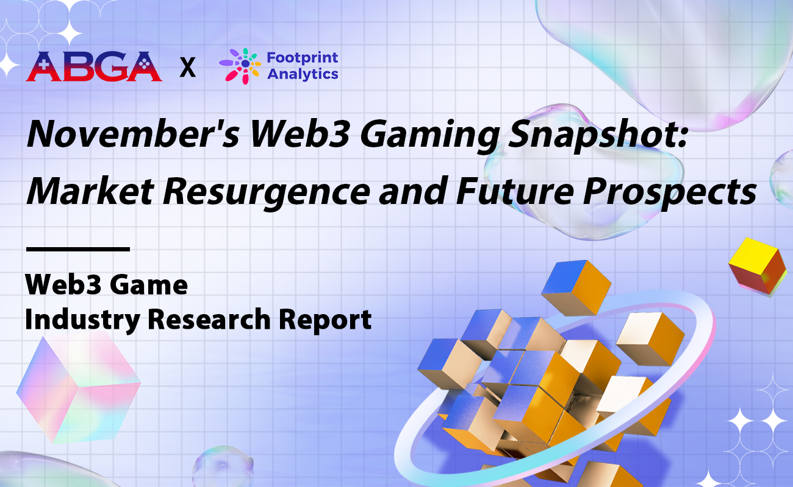

# ABGA - Asia Blockchain Gaming Alliance

---

## About Us

**ABGA (Asia Blockchain Gaming Alliance)** is a leading alliance that promotes the development and collaboration of blockchain gaming in Asia.  
We bring together top game studios, investors, and industry partners to build a thriving ecosystem for Web3 gaming.

Our mission is to support innovative projects, accelerate industry growth, and foster cross-border partnerships in the blockchain gaming space.

---

## What We Do

- 🧩 Incubate and support blockchain game projects  
- 🌍 Host global summits, conferences, and pitch competitions  
- 🤝 Build partnerships among developers, investors, and platforms  
- 📢 Advocate Web3 gaming adoption across Asia  

---

> 💡 ABGA is committed to building a sustainable and innovative future for the blockchain gaming industry.

🌐 [Website](https://www.abga.asia) | 📩 [Contact Us](mailto:info@abgaasia.org)
